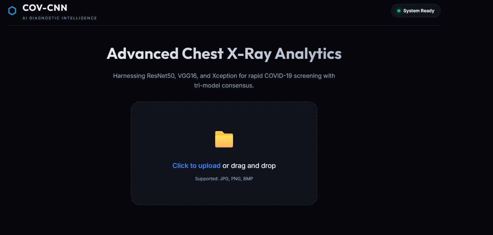
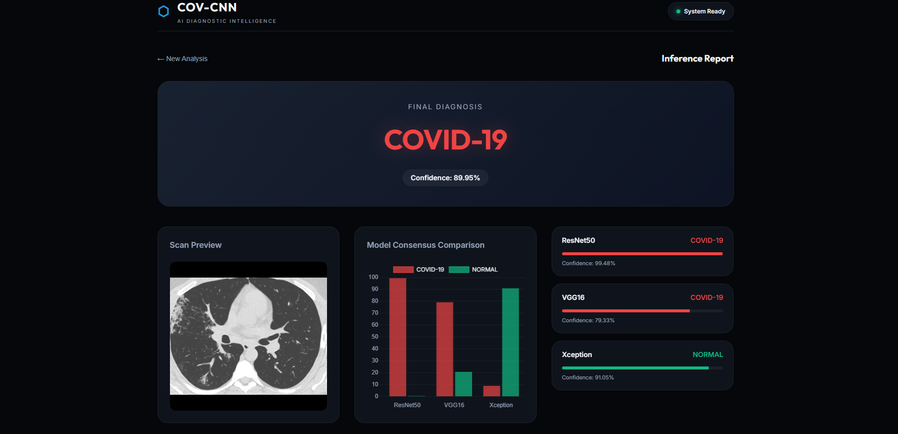
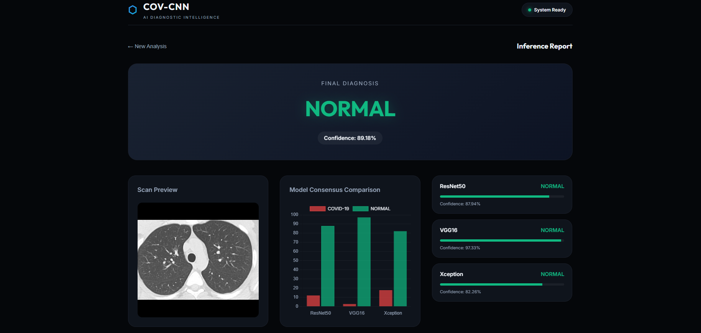

# COVID-19 Chest X-Ray Classifier


## Overview
A web-based classification tool for detecting COVID-19 from chest X-Ray imagery. The project implements a deep learning model ensemble evaluated via a decoupled API backend, removing the need for batch processing and enabling real-time image inference.

## Architecture & Implementation
The application is structured into three distinct layers:

1. **Model Pipeline (Jupyter / Keras)**
   - Utilizes transfer learning on three architectures: ResNet50, VGG16, and Xception.
   - Separate training scripts manage data augmentation and validation, exporting finalized weights as `.keras` binaries.

2. **Inference API (FastAPI / Uvicorn)**
   - **Lifespan Management:** Uses ASGI `@asynccontextmanager` to preload the heavy Keras models (up to ~300MB each) into memory once during server startup. This prevents I/O bottlenecks and memory leaks on consecutive requests.
   - **Inference Engine:** Validates incoming binaries, applies `LANCZOS` resampling to target dimensions (e.g., 150x150 for VGG16, 64x64 for ResNet50), and formats tensors.
   - **Ensemble Logic:** Executes model prediction and aggregates the output using a dynamic majority-vote algorithm to mitigate individual model bias. Fails safely if partial models are unavailable.

3. **Frontend UI (HTML / Vanilla JS)**
   - Static single-page interface mounted and served by the FastAPI application.
   - Communicates asynchronously with the backend `/predict` endpoint via `multipart/form-data` payloads, parsing the raw JSON response to the user.

## Tech Stack
- **Machine Learning**: TensorFlow 2.x, Keras, NumPy, Pillow
- **Web API**: Python 3.x, FastAPI, Uvicorn, Python-Multipart
- **Frontend**: HTML5, Vanilla JS, CSS3

## Repository Structure
```text
├── covid-backend/             # FastAPI backend and ML models
│   ├── backend.py             # FastAPI inference engine
│   ├── render.yaml            # Render deployment configuration
│   ├── requirements.txt       # Dependency definitions
│   └── *.keras                # Serialized model weights
├── web_ui/                    # Static frontend interfaces
│   ├── vercel.json            # Vercel frontend deployment configuration
│   └── (HTML/CSS/JS files) 
├── screenshots/               # Interface screenshots
├── run_backend.bat            # Windows startup script
└── *.ipynb                    # Training and exploratory data analysis notebooks
```

## Setup & Running

**Prerequisites:** Python 3.8+ 

1. **Clone and Install Dependencies:**
   ```bash
   git clone <repo-url>
   cd CNN_project/covid-backend
   pip install -r requirements.txt
   ```
   *(Note: Large `.keras` files may require Git LFS if tracked via Git.)*

2. **Start the Server:**
   - **Windows:** Double-click `run_backend.bat` from the root directory.
   - **Manual:** Navigate to `covid-backend/` and run `python backend.py`.

3. **Access UI:** 
   Navigate to `http://127.0.0.1:8000/`

## Deployment Ready
- **Backend (Render):** A `render.yaml` blueprint is provided in the `covid-backend/` directory for deploying the FastAPI server to [Render](https://render.com). Ensure Render's **Root Directory** is set to `covid-backend/`.
- **Frontend (Vercel):** A `vercel.json` configuration configures frontend routing. Set Vercel's **Root Directory** to `web_ui/`. Update the `API_URL` variable in `script.js` to point to your new Render deployment!

## Core API Endpoints
- `GET /health` - Returns 200 OK along with a list of successfully loaded Keras models in memory.
- `POST /predict` - Accepts `multipart/form-data` image uploads. Returns the majority vote classification, aggregate confidence levels, and per-model metrics.

## Technical Highlights
- **Decoupled Architecture**: Separating the inference engine into a REST API allows the frontend to run independently and opens up potential for mobile clients or external microservices.
- **Graceful Degradation**: The API prediction block uses `try/except` at the per-model level. If one model fails during inference, the final verdict logic evaluates the remaining valid outputs.
- **Resource Management**: Configured TensorFlow logging constraints and dynamic tensor shape handling to prevent API crashes on malformed data.

## Future Development
- Add `Dockerfile` and `docker-compose.yml` to standardize environment deployment.
- Integrate Grad-CAM (Gradient-weighted Class Activation Mapping) to visually highlight symptomatic regions identified by the convolutional layers.
- Transition frontend to a modern component-based framework (React/Svelte) for better state management.

## Application Interface

The screenshots below demonstrate the decoupled frontend handling real-time inference and dynamically rendering the model consensus and JSON payloads.

### 1. Upload Interface
*The drag-and-drop dashboard decoupled from the FastAPI backend. File inputs are handled client-side and sent directly as multi-part form data to the inference endpoints.*



### 2. Ensemble Fault-Tolerance: COVID-19 Detection
*A positive COVID-19 diagnosis demonstrating the necessity of the ensemble architecture. While the `Xception` model incorrectly converged on a false negative (NORMAL @ 91.05%), the `ResNet50` and `VGG16` models correctly identified the infection. The dynamic majority-voting algorithm successfully overrode the false negative to return an accurate `Final Diagnosis`.*



### 3. Consensus Validation: NORMAL Lung Output
*A healthy NORMAL diagnosis. The Chart.js instance dynamically visualizes the `raw_scores` output tensors from the FastAPI backend. All three independent architectures reached a consensus, producing a high-confidence final verdict.*



